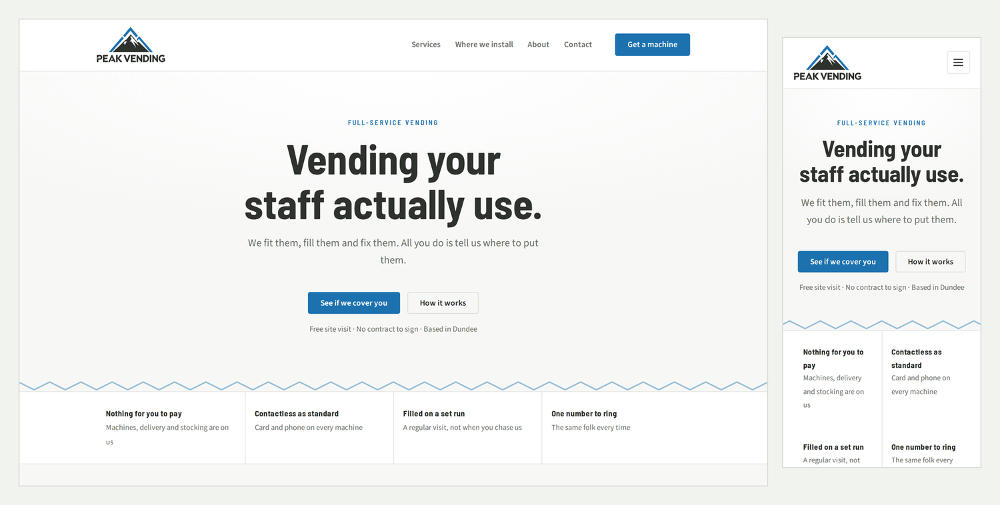

# Peak Vending

Production marketing site for a Scottish vending operator, live at
**[peak-vending.com](https://peak-vending.com)**.

Astro, static output, Cloudflare Workers. Sixteen pages of HTML on a CDN and one
server-rendered route. No client framework, no CSS framework, no analytics, no
cookies. Built and shipped solo, client work rather than a tutorial project.



```bash
npm ci && npm run check && npm run build && npm run audit:a11y
```

That is the whole verification story: types, build, and a real accessibility
sweep. It runs on every push. Nothing in this README is a claim you have to take
on trust.

---

## The three things worth looking at

**1. The Content-Security-Policy is generated at build time, not hand-written.**
[`scripts/security-headers.mjs`](scripts/security-headers.mjs)

Astro emits inline `<script>` and `<style>` blocks whose contents change with the
source, so a hand-written policy silently rots and starts blocking the site's own
JavaScript. Most projects give up here and reach for `unsafe-inline`. Instead the
generator hashes every inline block after each build and writes the policy from
that — so the deployed CSP carries **no `unsafe-inline` for scripts or styles**,
and cannot drift out of date. If a `style="..."` attribute ever appears — which
can't be hashed — the build fails rather than quietly weakening the policy.

**2. Accessibility is a gate, not an aspiration.**
[`scripts/audit-a11y.mjs`](scripts/audit-a11y.mjs)

`npm run audit:a11y` serves the built site, runs axe-core over every page at
1440px and 390px, then does the things automation usually skips: tabs through the
page asserting a visible focus ring at every stop, checks `prefers-reduced-motion`
actually disables transitions, checks for horizontal scrolling at 320px, and
validates heading structure. Exits non-zero on any finding. Currently 0
violations across all pages.

**3. The one server route is treated as hostile input.**
[`src/pages/api/contact.ts`](src/pages/api/contact.ts)

| Risk | Mitigation |
| --- | --- |
| CSRF via form POST | JSON is stopped by preflight; form POSTs are not, so `Origin`/`Referer` must match the host |
| Email header injection | Control characters stripped before any field reaches a subject line or address |
| HTML injection | Every interpolated value escaped |
| Spam and abuse | Honeypot, a three-second timing trap, and 5 submissions per IP per hour in Workers KV |
| Oversized payloads | Every field length-capped before processing |
| Error leakage | Provider errors go to logs; the client gets a generic message |

Each of these was verified against the compiled Worker rather than reasoned
about — a cross-origin POST returns 403, and `Acme\r\nBcc: victim@example.com`
lands in the subject as flat text.

Also set: HSTS with preload, `X-Content-Type-Options`, `Referrer-Policy`,
a `Permissions-Policy` denying every sensor and payment API, `frame-ancestors
'none'`, `base-uri 'none'`, `no-store` on `/api/*`. SPF, DKIM and DMARC are
configured on the domain; DMARC is at `p=quarantine`.

---

## Why it is built this way

**Static by default, dynamic only where it must be.** A brochure site has one
interactive feature: a contact form. Server-rendering that single route and
leaving everything else as static HTML means the site costs nothing to serve,
absorbs a traffic spike without configuration, and has almost no attack surface.

**No client framework.** Total JavaScript shipped is a few kilobytes — a class
toggle for no-JS fallbacks, an `IntersectionObserver` for reveal animations, and
the form's submit handler. React would have been larger than the site.

**Plain CSS with custom properties.** `src/styles/tokens.css` holds the type
scale, spacing scale and palette. Astro scopes component styles automatically, so
there is no naming convention to enforce and no specificity arms race.

**One source of truth for business facts.** Every address, service area and
contact detail lives in `src/data/site.ts`. Change it once and the nav, footer,
contact page, JSON-LD and both email templates follow. Services and locations are
Markdown content collections — a new page is a new file.

**Emails are pure functions.** [`src/lib/emails.ts`](src/lib/emails.ts) takes
form fields and returns `{ subject, html, text }`, so both templates can be
rendered and inspected without standing up a server. The markup is deliberately
old-fashioned — nested tables, inline styles, no flexbox — because that is what
Outlook and Gmail actually render.

---

## Layout

```
.github/workflows/ci.yml   Type-check, build, a11y audit, CSP assertion
content/                   Markdown: services, locations, sponsors
scripts/
  security-headers.mjs     Generates dist/client/_headers after each build
  audit-a11y.mjs           axe-core + manual WCAG checks
src/
  components/              Nav, Footer, ContactForm, Logo, Icon, Machine
  data/site.ts             Single source of truth for business facts
  layouts/Base.astro       Head, JSON-LD, skip link
  lib/emails.ts            Transactional email builders
  pages/api/contact.ts     The only server route
  styles/                  tokens.css, base.css, components.css
public/                    Favicons, manifest, OG image, email artwork
```

| Command | What it does |
| --- | --- |
| `npm run dev` | Vite dev server |
| `npm run build` | Production build, then regenerates the security headers |
| `npm run preview` | The **real** Worker bundle locally, via Wrangler |
| `npm run deploy` | Build and deploy to Cloudflare |
| `npm run check` | Type-check |
| `npm run audit:a11y` | Accessibility suite against `dist/` |

`npm run preview` is the one that matters before a deploy — `dev` runs Vite,
`preview` runs the actual bundle Cloudflare will execute, contact endpoint and
KV included.

---

## Honest limitations

- **No unit tests.** The endpoint was verified by driving the compiled Worker
  with real requests, which for one route caught more than unit tests would
  have. A second route would change that answer.
- **Rate limiting is per-IP in KV.** Fine for a local business; trivially
  defeated by a distributed source. Turnstile would be the next step if it ever
  became a target.
- **`p=quarantine`, not `p=reject`.** Deliberate. Reject is the destination, but
  only after the DMARC reports come back clean for a few weeks.

---

## Licence

Code is MIT — reuse it. The Peak Vending name, logo, imagery and written copy
belong to the client and are excluded. See [LICENSE](LICENSE).
